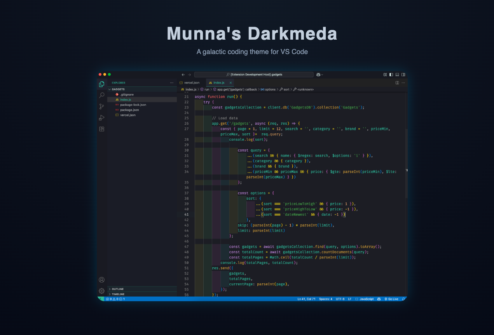

  

<h1 align="center">🌌 Munna's Darkmeda</h1>

  A galactic, modern, and beautifully dark Visual Studio Code theme. 
  Designed for developers who love deep focus and cosmic aesthetics.

---

## ✨ Features

- 🌑 Elegant **dark background** with smooth contrast
- 🎨 Beautiful **syntax colors** for JavaScript, React, HTML, CSS, Node.js & more
- 🌌 Inspired by the **stars** — with a deep bluish glow and futuristic feel
- 💻 Perfect for long coding sessions — soft on the eyes

---

## 🚀 Installation

1. Open **Visual Studio Code**
2. Go to the Extensions view → `Ctrl + Shift + X`
3. Search for **Munna's Darkmeda**
4. Click **Install**
5. Press `Ctrl + K` → `Ctrl + T` to select the theme

## 🧠 Theme Philosophy

> “Code in the cosmos.”

**Munna's Darkmeda** is more than just a theme —  
it’s a vibe. A calm, interstellar workspace to help you focus, flow, and feel good while coding.

## ⚖️ License

MIT — use it, modify it, share it. 💜
